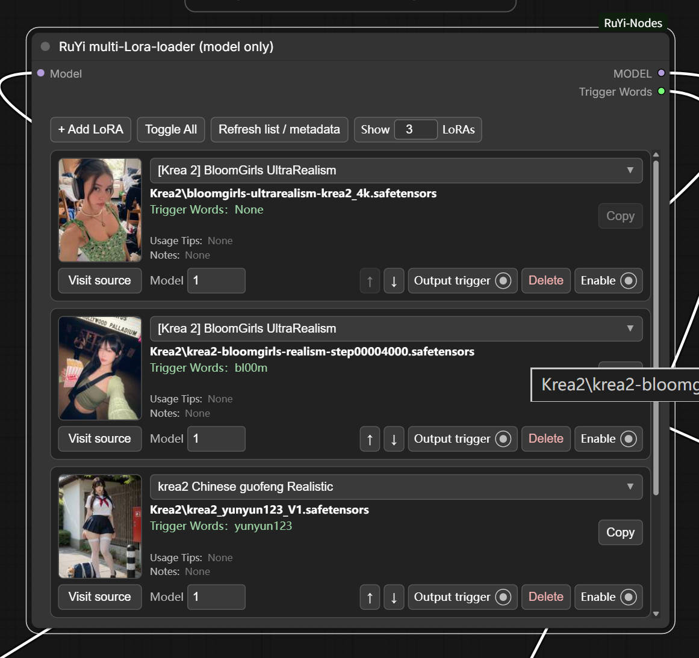
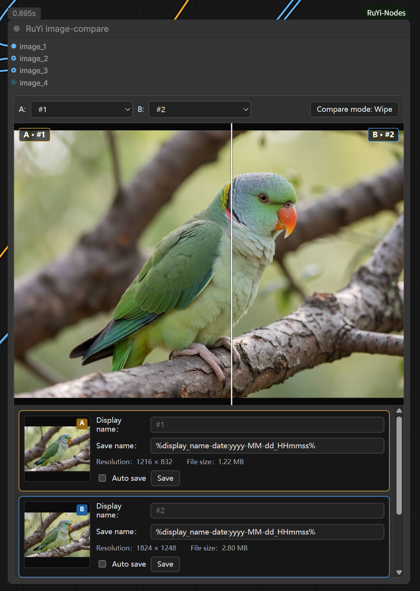
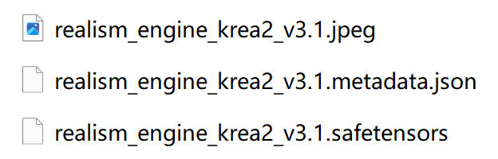
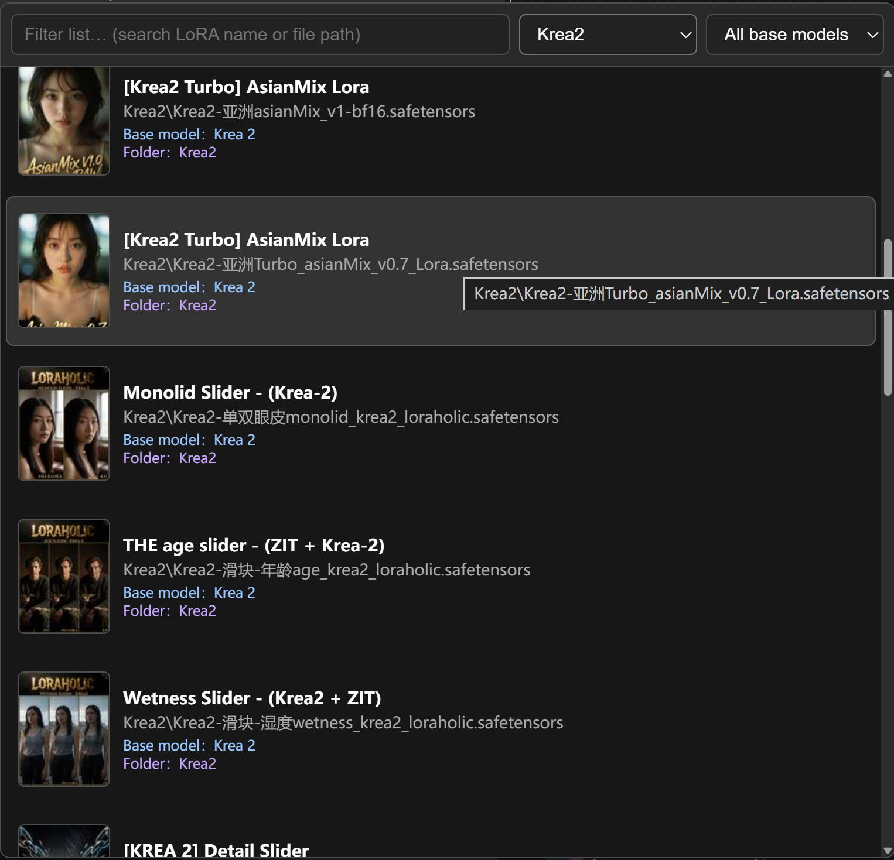
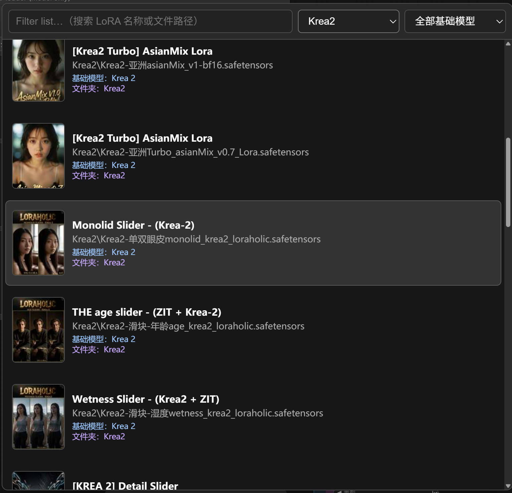
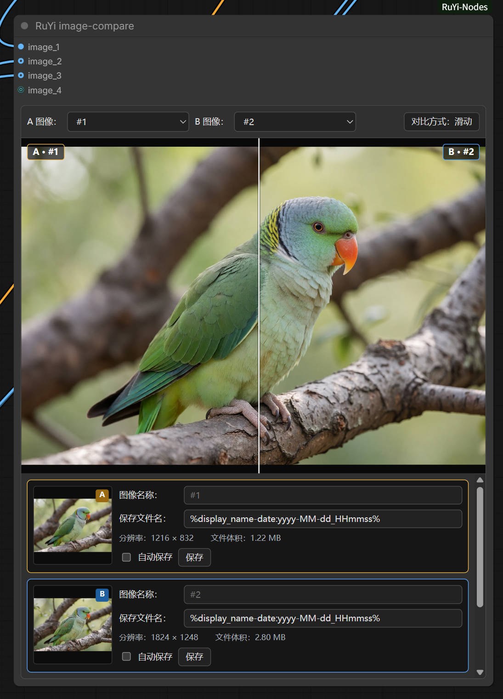

# RuYi-Nodes

**[English](#english) | [简体中文](#简体中文)**

A lightweight collection of practical custom nodes for ComfyUI.  
面向 ComfyUI 的轻量实用自定义节点合集。

<table>
<tr>
<td width="50%" valign="top">
<h3 align="center">Visual Multi-LoRA Loader<br>可视化 Multi-LoRA 加载器</h3>
<p align="center"></p>
<ul>
<li>Manage multiple LoRAs in one node / 单节点管理多个 LoRA</li>
<li>Preview covers, metadata and trigger words / 封面、元数据与触发词可视化</li>
<li>Independent strengths, enable switches and ordering / 独立权重、开关与排序</li>
<li>MODEL+CLIP and model-only variants / 支持完整与仅模型两种加载器</li>
</ul>
</td>
<td width="50%" valign="top">
<h3 align="center">Image Compare & Save<br>图像对比与保存</h3>
<p align="center"></p>
<ul>
<li>Dynamic multi-image A/B comparison / 动态多图 A/B 对比</li>
<li>Wipe and click comparison modes / 滑动与点击切换模式</li>
<li>Per-image naming, auto-save and manual save / 独立命名、自动保存与手动保存</li>
<li>Media Assets integration + workflow PNG metadata / 媒体资产集成与工作流 PNG 元数据</li>
</ul>
</td>
</tr>
</table>

> RuYi-Nodes currently focuses on two core workflows: **visual Multi-LoRA management** and **image comparison/saving**. A lightweight STRING preview node is also included as a supporting utility.  
> RuYi-Nodes 当前优先提供两类核心能力：**可视化 Multi-LoRA 管理**与**图像对比/保存**，并附带轻量的 STRING 文本监视工具。

---

## English

### Included nodes

| Node | Input | Output | Purpose |
| --- | --- | --- | --- |
| **RuYi multi-Lora-loader** | `MODEL`, `CLIP` | `MODEL`, `CLIP`, `trigger_words` | Load and visually manage multiple LoRAs with independent MODEL / CLIP strengths. |
| **RuYi multi-Lora-loader (model only)** | `MODEL` | `MODEL`, `trigger_words` | Load multiple LoRAs into MODEL only; useful for Krea2 / Flux-style workflows. |
| **RuYi image-compare** | Dynamic `IMAGE` inputs | — | Compare any two connected images, inspect them and save them with independent rules. |
| **RuYi text-preview** | `STRING` | `STRING` | Display the complete input STRING after execution and pass it through unchanged. |

### Visual Multi-LoRA Loader

The RuYi Multi-LoRA loaders are designed to keep large LoRA stacks readable and manageable inside a single node.

Key features:

- Add, remove, reorder and enable/disable LoRAs independently.
- Full loader supports independent **MODEL** and **CLIP** strengths.
- Model-only loader is intended for workflows where LoRAs are applied only to MODEL / UNET.
- In-node preview thumbnails when metadata/preview information is available.
- Searchable LoRA picker with separate **Folder** and **Base model** filters.
- Per-node **Show N LoRAs** viewport control (`3` by default, `0` = unlimited).
- Optional `trigger_words` STRING output with de-duplication across enabled LoRAs.
- Per-LoRA **Output trigger** toggle determines whether that LoRA contributes trigger words.
- Metadata-aware display for usage tips, notes, source links, base model and recommended weights.
- English and Simplified Chinese UI.

#### Recommended companion: ComfyUI-Lora-Manager

RuYi-Nodes works independently for normal multi-LoRA loading.

For preview images, trigger words, base-model information, recommended weights, notes, usage tips and source links, **[ComfyUI-Lora-Manager](https://github.com/willmiao/ComfyUI-Lora-Manager)** is recommended. RuYi-Nodes reads the `.metadata.json` sidecar files generated by LoRA Manager.

> **Note:** LoRA Manager is only recommended for metadata-aware LoRA features. **RuYi image-compare does not depend on LoRA Manager.**

Expected sidecar layout:

```text
my_lora.safetensors
my_lora.metadata.json
my_lora.jpeg
```



If metadata is unavailable, normal LoRA loading still works.

#### LoRA Picker

Search and filter LoRAs by **Folder** or **Base model**, with previews when available.



#### Trigger-word output

Both LoRA loaders expose an optional `trigger_words` STRING output.

For each enabled LoRA, **Output trigger** determines whether its trigger words are included. Trigger words from selected entries are combined and de-duplicated.

Leaving `trigger_words` unconnected is valid and does not affect LoRA loading.

A common prompt workflow is:

```text
Main prompt STRING ───────────┐
                              ├─ STRING concatenate / combine ──> final prompt STRING
RuYi trigger_words STRING ───┘
                                                    │
                                                    └─> RuYi text-preview
```

#### Krea2 / model-only workflow

For Krea2-style workflows where LoRAs are applied to MODEL only, use:

```text
MODEL / UNET
    │
    ▼
RuYi multi-Lora-loader (model only)
    │
    ▼
MODEL
```

Keep the text encoder / CLIP path separate unless your workflow specifically requires otherwise.

### Image Compare & Save

**RuYi image-compare** is a visual terminal node for comparing multiple image outputs without repeatedly rewiring a two-image compare node.


#### Comparison

1. Connect one or more IMAGE outputs. A new IMAGE input is added automatically as connections grow.
2. Use the **A** and **B** dropdowns to select any two connected images.
3. Choose a comparison mode:
   - **Compare mode: Wipe** — move the pointer horizontally over the preview to change the split position.
   - **Compare mode: Click** — click the preview to switch between A and B.
4. The image list below the preview handles naming, information and saving; A/B selection remains in the top dropdowns.

Each image entry shows:

- Preview thumbnail.
- **Display name** used inside the node and A/B selectors.
- Independent **Save name** / path template.
- Resolution and PNG file size.
- Per-image **Auto save** toggle.
- Per-image **Save** button.

Display names and save names are independent. For example, an image may display as `Second pass` while being saved with a different filename rule.

#### Media Assets and workflow metadata

Image Compare outputs are exposed through ComfyUI's standard image-output channel, so generated comparison candidates appear in **Media Assets → Generated** and task/output history.

The redundant native image preview is suppressed inside the node itself, leaving the custom A/B comparison interface as the primary preview.

PNG previews/saves preserve ComfyUI prompt/workflow metadata when metadata is enabled. A saved PNG can therefore be dragged back into ComfyUI to restore its workflow and generation information.

#### Save / Auto save

If **Save name** does not contain an explicit folder, images are saved under:

```text
ComfyUI/output/RuYi-Compare/
```

Default save-name template:

```text
%display_name-date:yyyy-MM-dd_HHmmss%
```

RuYi filename variables:

```text
User fields:
%display_name%   %save_name%

Auto-generated:
%index%   %input%   %frame%   %date:yyyy-MM-dd_HHmmss%
```

Relative subfolder example:

```text
Compare/%display_name-date:yyyy-MM-dd_HHmmss%
```

which saves under:

```text
ComfyUI/output/RuYi-Compare/Compare/
```

Absolute Windows path example:

```text
C:\YourFolder\%display_name-date:yyyy-MM-dd_HHmmss%
```

Repeated filenames are protected from overwrite by adding a numeric suffix.

When an input image actually changes after a new execution, the previous save-status message for that image is cleared automatically.

#### Thumbnail context menu: full-resolution image actions

Right-click a candidate thumbnail for:

- **Save as...** — choose a destination using the system/browser save flow and save the **full-resolution source image**.
- **Copy image** — copy the **full-resolution source image** to the clipboard.

These actions are separate from the RuYi **Save** button: **Save** follows the per-image Save-name/path template, while **Save as...** is an interactive system save operation.

### Installation

#### Option A — Git clone

Open a terminal in `ComfyUI/custom_nodes` and run:

```bash
git clone https://github.com/RuYi-Xiao/RuYi-Nodes.git
```

Restart ComfyUI after installation.

To update later:

```bash
cd RuYi-Nodes
git pull
```

#### Option B — Manual ZIP

1. Download the repository ZIP from GitHub.
2. Extract it into `ComfyUI/custom_nodes`.
3. Make sure the final directory is named `RuYi-Nodes` and contains `__init__.py` directly inside it.
4. Restart ComfyUI.

Search for:

```text
RuYi multi-Lora-loader
RuYi multi-Lora-loader (model only)
RuYi image-compare
RuYi text-preview
```

### Changelog

See [CHANGELOG.md](CHANGELOG.md) for version history.

### License

RuYi-Nodes is released under the [MIT License](LICENSE).

---

## 简体中文

### 包含的节点

| 节点 | 输入 | 输出 | 用途 |
| --- | --- | --- | --- |
| **RuYi 多 LoRA 加载器** | `MODEL`、`CLIP` | `MODEL`、`CLIP`、`trigger_words` | 在一个节点中可视化管理多个 LoRA，并分别控制 MODEL / CLIP 权重。 |
| **RuYi 多 LoRA 加载器（仅模型）** | `MODEL` | `MODEL`、`trigger_words` | 只向 MODEL 加载多个 LoRA，适合 Krea2 / Flux 一类仅模型 LoRA 工作流。 |
| **RuYi 图像对比** | 动态 `IMAGE` 输入 | — | 从多个输入中选择任意两张进行 A/B 对比、检查与独立保存。 |
| **RuYi 文本监视** | `STRING` | `STRING` | 执行后显示完整输入文本，并将 STRING 原样继续输出。 |

### 可视化 Multi-LoRA 加载器

RuYi Multi-LoRA 加载器的目标是在一个节点中保持较大的 LoRA 堆栈仍然清晰、可管理。

主要功能：

- 独立添加、删除、排序、启用/停用每个 LoRA。
- 完整版可分别设置 **MODEL** 与 **CLIP** 权重。
- **仅模型**版本适合 LoRA 只应用到 MODEL / UNET 的工作流。
- 可用时直接在节点中显示 LoRA 预览封面。
- LoRA 选择器支持搜索，并分别按**文件夹**与**基础模型**筛选。
- 每个节点可独立设置**显示 N 个 LoRA**（默认 `3`，`0` 表示不限高度）。
- 可选 `trigger_words` STRING 输出，并对多个已启用 LoRA 的触发词自动去重。
- 每个 LoRA 的**输出触发词**开关决定它是否参与最终触发词输出。
- 可显示使用说明、附加备注、来源链接、基础模型与推荐权重等元数据。
- 支持英文 / 简体中文界面。

#### 推荐配套：ComfyUI-Lora-Manager

RuYi-Nodes 本身可以独立完成正常的多 LoRA 加载。

如需预览图、触发词、基础模型信息、推荐权重、使用说明、附加备注和来源链接，推荐配合 **[ComfyUI-Lora-Manager](https://github.com/willmiao/ComfyUI-Lora-Manager)** 使用。RuYi-Nodes 会读取 LoRA Manager 生成的 `.metadata.json` sidecar 文件。

> **注意：** LoRA Manager 只推荐用于 LoRA 元数据相关功能，**RuYi 图像对比不依赖 LoRA Manager。**

预期 sidecar 结构：

```text
my_lora.safetensors
my_lora.metadata.json
my_lora.jpeg
```


即使没有元数据，正常 LoRA 加载仍然可以使用。

#### LoRA 选择器

可按**文件夹**或**基础模型**搜索和筛选 LoRA，并在可用时显示预览图。



#### 触发词输出

两个 LoRA 加载器都会提供可选的 `trigger_words` STRING 输出。

对于每个已启用 LoRA，**输出触发词**决定其触发词是否加入最终 STRING。多个 LoRA 的触发词会合并并自动去重。

`trigger_words` 不连接也不会影响 LoRA 本身的加载。

一种常见连接方式：

```text
主提示词 STRING ─────────────┐
                              ├─ STRING 合并节点 ──> 最终提示词 STRING
RuYi trigger_words STRING ───┘
                                           │
                                           └─> RuYi 文本监视
```

#### Krea2 / 仅模型工作流

对于 Krea2 一类只需要把 LoRA 应用到 MODEL 的工作流，建议使用：

```text
MODEL / UNET
    │
    ▼
RuYi 多 LoRA 加载器（仅模型）
    │
    ▼
MODEL
```

文本编码器 / CLIP 路径保持独立，除非具体工作流另有要求。

### 图像对比与保存

**RuYi 图像对比**是用于快速比较多个图像输出的可视化终端节点，不需要为了比较不同图片反复重新连接普通双图对比节点。



#### 图像对比

1. 连接一个或多个 IMAGE 输出；随着连接增加，节点会自动增加新的 IMAGE 输入。
2. 通过顶部 **A** / **B** 下拉列表，从所有已连接图片中自由选择任意两张。
3. 两种对比方式：
   - **对比方式：滑动** — 在预览区左右移动鼠标改变分割位置。
   - **对比方式：点击** — 点击预览区在 A / B 两张图片之间切换。
4. 下方图片列表负责信息、命名和保存管理；A/B 选择仍由顶部下拉列表完成。

每张图片项目显示：

- 图片缩略图。
- **图像名称** — 用于节点内部显示和 A/B 下拉列表。
- 独立的**保存文件名** / 路径模板。
- 分辨率和 PNG 文件体积。
- 每张图片独立的**自动保存**开关。
- 每张图片独立的**保存**按钮。

图像名称与保存文件名互相独立。例如节点中可以显示为“二采输出”，实际保存时使用另一套文件名规则。

#### 媒体资产与工作流元数据

图像对比结果通过 ComfyUI 标准图片输出通道注册，因此候选图会出现在 **媒体资产 → 已生成** 以及任务/输出历史中。

节点内部会抑制 ComfyUI 默认的重复图片预览，只保留 RuYi 自己的 A/B 对比界面作为主要预览区域。

在没有关闭 ComfyUI metadata 的情况下，RuYi 生成/保存的 PNG 会保留 `prompt` 与 `workflow` 等 ComfyUI 元数据。将保存的 PNG 拖回 ComfyUI，可以恢复对应工作流和生成信息。

#### 保存 / 自动保存

如果**保存文件名**没有指定目录，默认保存到：

```text
ComfyUI/output/RuYi-Compare/
```

默认保存模板：

```text
%display_name-date:yyyy-MM-dd_HHmmss%
```

RuYi 文件名变量：

```text
用户填写：
%display_name%   %save_name%

自动生成：
%index%   %input%   %frame%   %date:yyyy-MM-dd_HHmmss%
```

相对子目录示例：

```text
对比结果/%display_name-date:yyyy-MM-dd_HHmmss%
```

保存到：

```text
ComfyUI/output/RuYi-Compare/对比结果/
```

Windows 绝对路径示例：

```text
C:\YourFolder\%display_name-date:yyyy-MM-dd_HHmmss%
```

重复文件名不会覆盖已有图片，而是自动追加数字后缀。

当某个输入在新一轮工作流执行后真正变成新的图像内容时，该图片之前显示的保存状态提示会自动清除。

#### 缩略图右键：原图操作

右键候选图片的缩略图可以使用：

- **另存为** — 使用系统/浏览器保存流程选择位置，并保存该候选项对应的**原始分辨率图片**。
- **复制图片** — 将该候选项对应的**原始分辨率图片**复制到剪贴板。

它们与节点里的 **保存**按钮用途不同：**保存**遵循当前图片的“保存文件名/路径模板”；**另存为**则是交互式的系统另存操作。

### 安装

#### 方法 A — Git clone

在 `ComfyUI/custom_nodes` 目录打开终端：

```bash
git clone https://github.com/RuYi-Xiao/RuYi-Nodes.git
```

安装完成后重启 ComfyUI。

以后更新：

```bash
cd RuYi-Nodes
git pull
```

#### 方法 B — 手动 ZIP

1. 在 GitHub 下载仓库 ZIP。
2. 解压到 `ComfyUI/custom_nodes`。
3. 确认最终目录名为 `RuYi-Nodes`，并且 `__init__.py` 直接位于这个目录中。
4. 重启 ComfyUI。

可以搜索：

```text
RuYi 多 LoRA 加载器
RuYi 多 LoRA 加载器（仅模型）
RuYi 图像对比
RuYi 文本监视
```

### 更新记录

版本历史见 [CHANGELOG.md](CHANGELOG.md)。

### 许可证

RuYi-Nodes 使用 [MIT License](LICENSE) 发布。
