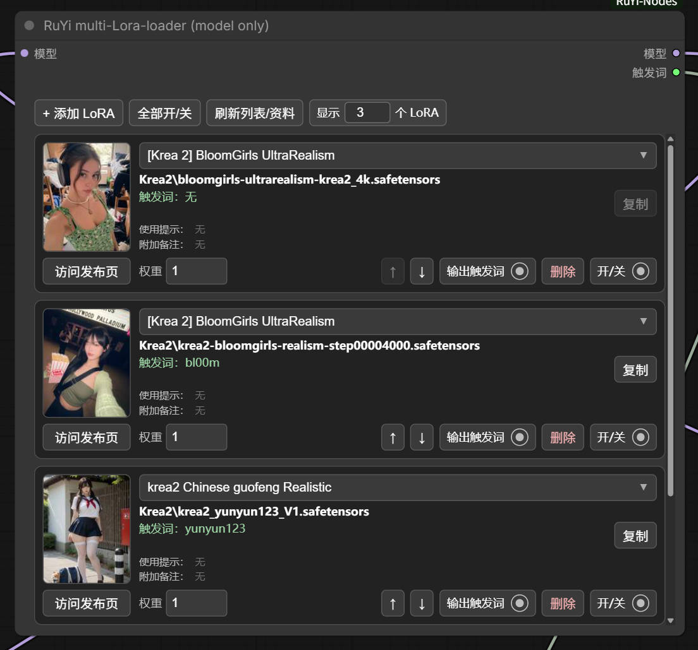

# RuYi-Nodes

**[English](#english) | [简体中文](#简体中文)**

A lightweight collection of practical custom nodes for ComfyUI.  
面向 ComfyUI 的轻量实用自定义节点合集。

**RuYi-Nodes 的开发依靠 ChatGPT 辅助编程完成。**  
**RuYi-Nodes was developed through ChatGPT-assisted coding.**

---

## English

**RuYi-Nodes** is a lightweight collection of practical ComfyUI custom nodes for workflow utilities, LoRA handling, text inspection, image comparison, and other useful tools.


### Highlights

- Manage multiple LoRAs inside a single node.
- Enable or disable each LoRA independently.
- Independent MODEL / CLIP strengths in the full loader.
- Reorder and delete LoRAs, or toggle all entries at once.
- In-node preview thumbnails.
- Searchable LoRA picker with separate **Folder** and **Base model** filters.
- Per-node **Show N LoRAs** viewport control (`3` by default, `0` = unlimited).
- Optional trigger-word output with de-duplication across enabled LoRAs.
- Per-LoRA **Output trigger** toggle controls whether that LoRA contributes trigger words to the STRING output.
- Trigger Words preview with copy action.
- Metadata-aware display for usage tips, notes, source links, base model and recommended weights.
- Compare any two images from a dynamically growing set of IMAGE inputs.
- Switch between **wipe comparison** and **click-to-toggle** comparison modes.
- Give each image its own display name and independent save name.
- Per-image resolution, PNG file-size display, auto-save toggle and manual save button.
- Save-name templates support RuYi variables, relative subfolders and absolute output paths.
- English and Simplified Chinese localization.
- No additional Python packages are required beyond the libraries already used by a normal ComfyUI installation.

### Recommended companion: ComfyUI-Lora-Manager

RuYi-Nodes works independently for normal multi-LoRA loading.

For preview images, trigger words, base-model information, recommended weights, notes, usage tips and source links, **[ComfyUI-Lora-Manager](https://github.com/willmiao/ComfyUI-Lora-Manager)** is recommended. RuYi-Nodes reads the `.metadata.json` sidecar files generated by LoRA Manager.

> **Note:** ComfyUI-Lora-Manager is only recommended for the metadata-aware LoRA features. **RuYi image-compare does not depend on LoRA Manager.**

Expected sidecar layout:

```text
my_lora.safetensors
my_lora.metadata.json
my_lora.jpeg
```


Currently, LoRA Manager's `.metadata.json` format is supported. If metadata is unavailable, normal LoRA loading still works.

### Included nodes

| Node | Input | Output | Purpose |
| --- | --- | --- | --- |
| **RuYi multi-Lora-loader** | `MODEL`, `CLIP` | `MODEL`, `CLIP`, `trigger_words` | Load multiple LoRAs with independent MODEL and CLIP strengths. |
| **RuYi multi-Lora-loader (model only)** | `MODEL` | `MODEL`, `trigger_words` | Load multiple LoRAs into MODEL only; useful for Krea2 / Flux-style workflows. |
| **RuYi text-preview** | `STRING` | `STRING` | Display the complete input STRING after execution and pass it through unchanged. |
| **RuYi image-compare** | Dynamic `IMAGE` inputs | — | Select any two connected images for A/B comparison, inspection and optional saving. |

### Installation

#### Option A — Git clone (recommended)

Open a terminal in `ComfyUI/custom_nodes` and run:

```bash
git clone https://github.com/RuYi-Xiao/RuYi-Nodes.git
```

Restart ComfyUI after installation.

To update later:

```bash
cd RuYi-Nodes
git pull
```

#### Option B — Manual ZIP installation

1. Download the repository ZIP from GitHub.
2. Extract it into your ComfyUI `custom_nodes` directory.
3. Make sure the final directory is named `RuYi-Nodes` and contains `__init__.py` directly inside it.
4. Restart ComfyUI.

After restarting ComfyUI, search for:

```text
RuYi multi-Lora-loader
RuYi multi-Lora-loader (model only)
RuYi text-preview
RuYi image-compare
```

### Quick Start — LoRA

1. Add a RuYi multi-LoRA loader and connect `MODEL` / `CLIP` as required.
2. Click **Add LoRA** and select your LoRAs.
3. Adjust strengths and enable **Output trigger** where needed.
4. Connect `trigger_words` to your prompt workflow if required.
5. Use **RuYi text-preview** to inspect the final STRING.

### Image Compare

**RuYi image-compare** is a visual terminal node for quickly comparing multiple image outputs without repeatedly rewiring a two-image compare node.


#### Basic comparison

1. Connect one or more IMAGE outputs. A new IMAGE input is added automatically as connections grow.
2. Use the **A** and **B** dropdowns to select any two connected images.
3. Choose the comparison mode:
   - **Compare mode: Wipe** — move the pointer horizontally over the preview to change the split position.
   - **Compare mode: Click** — click the preview to switch between A and B.
4. The image list below the preview is used for naming, information display and saving; A/B selection is handled by the dropdowns above.

Each image entry shows:

- Preview thumbnail.
- **Display name** — the human-readable label used inside the node and in the A/B selectors.
- **Save name** — an independent filename/path template used when saving that image.
- Resolution.
- PNG file size.
- Per-image **Auto save** toggle.
- Per-image **Save** button for manual saving.

Display names and save names are independent. For example, an image may be displayed as `Second pass` while being saved with a different naming rule.

#### Saving images

By default, images without an explicit folder are saved under:

```text
ComfyUI/output/RuYi-Compare/
```

The default save-name template is:

```text
%display_name-date:yyyy-MM-dd_HHmmss%
```

Example output:

```text
Second pass-2026-08-27_163000.png
```

RuYi filename variables include:

```text
User fields:
%display_name%   %save_name%

Auto-generated:
%index%   %input%   %frame%   %date:yyyy-MM-dd_HHmmss%
```

Relative subfolders can be written directly in **Save name**:

```text
Compare/%display_name-date:yyyy-MM-dd_HHmmss%
```

which saves under:

```text
ComfyUI/output/RuYi-Compare/Compare/
```

An absolute path can also be used, for example on Windows:

```text
C:\YourFolder\%display_name-date:yyyy-MM-dd_HHmmss%
```

When the input image changes after a new workflow execution, the previous save-status message for that image is cleared automatically.

### LoRA Picker

Search and filter LoRAs by **Folder** or **Base model**, with previews when available.


### Trigger-word output

Both LoRA loaders expose an optional `trigger_words` STRING output.

For each enabled LoRA, **Output trigger** determines whether its trigger words are included. Trigger words from all selected entries are combined and de-duplicated.

Leaving `trigger_words` unconnected is valid and does not affect LoRA loading.

A common prompt workflow is:

```text
Main prompt STRING ───────────┐
                              ├─ STRING concatenate / combine ──> final prompt STRING
RuYi trigger_words STRING ───┘
                                                    │
                                                    └─> RuYi text-preview
```

Use **RuYi text-preview** to inspect the final merged prompt and trigger words.

### Krea2 / model-only workflow

For Krea2-style workflows where LoRAs are applied to MODEL only, use:

```text
MODEL / UNET
    │
    ▼
RuYi multi-Lora-loader (model only)
    │
    ▼
MODEL
```

Keep the text encoder / CLIP path separate unless your workflow specifically requires otherwise.

### Changelog

See [CHANGELOG.md](CHANGELOG.md) for version history.

### License

RuYi-Nodes is released under the [MIT License](LICENSE).

---

## 简体中文

**RuYi-Nodes** 是一组轻量、实用的 ComfyUI 自定义节点，主要用于工作流辅助、LoRA 管理、文本监视、图像对比及其他实用功能。



### 主要功能

- 在单个节点内管理多个 LoRA。
- 每个 LoRA 可独立启用或停用。
- 完整版加载器可分别设置 MODEL / CLIP 权重。
- 支持上移、下移、删除以及全部开关。
- 节点内显示 LoRA 预览图。
- 可搜索的 LoRA 选择器，并分别提供**文件夹**与**基础模型**筛选。
- 每个节点独立设置**显示 N 个 LoRA**（默认 `3`，`0` 表示无限制展开）。
- 可选的触发词 STRING 输出，并自动去重。
- 每个 LoRA 的**输出触发词**开关独立决定其触发词是否加入输出。
- 节点内显示触发词并提供复制按钮。
- 可显示使用说明、附加备注、来源链接、基础模型与推荐权重等元数据。
- 可动态连接多张 IMAGE，并从中自由选择任意两张进行 A/B 对比。
- 支持**滑动对比**与**点击切换**两种对比方式。
- 每张图片可分别设置节点内显示名称与独立保存文件名。
- 显示每张图片的分辨率、PNG 文件体积，并提供独立自动保存开关和手动保存按钮。
- 保存文件名支持 RuYi 变量、相对子目录以及绝对保存路径。
- 支持英文 / 简体中文本地化。
- 除正常 ComfyUI 已使用的库外，不需要额外安装 Python 依赖。

### 推荐配套：ComfyUI-Lora-Manager

RuYi-Nodes 可独立完成正常的多 LoRA 加载。

如需预览图、触发词、基础模型信息、推荐权重、使用说明、附加备注和来源链接，推荐配合 **[ComfyUI-Lora-Manager](https://github.com/willmiao/ComfyUI-Lora-Manager)** 使用。RuYi-Nodes 会读取 LoRA Manager 生成的 `.metadata.json` sidecar 元数据文件。

> **注意：** ComfyUI-Lora-Manager 只推荐用于 LoRA 元数据相关功能，**RuYi 图像对比不依赖 LoRA Manager。**

预期的 sidecar 文件结构：

```text
my_lora.safetensors
my_lora.metadata.json
my_lora.jpeg
```


目前支持 LoRA Manager 使用的 `.metadata.json` 元数据格式。即使没有元数据，正常的 LoRA 加载仍可使用。

### 包含的节点

| 节点 | 输入 | 输出 | 用途 |
| --- | --- | --- | --- |
| **RuYi 多 LoRA 加载器** | `MODEL`、`CLIP` | `MODEL`、`CLIP`、`trigger_words` | 同时加载多个 LoRA，并分别控制 MODEL 与 CLIP 权重。 |
| **RuYi 多 LoRA 加载器（仅模型）** | `MODEL` | `MODEL`、`trigger_words` | 仅向 MODEL 加载多个 LoRA，适合 Krea2 / Flux 一类仅模型 LoRA 工作流。 |
| **RuYi 文本监视** | `STRING` | `STRING` | 执行后显示完整输入文本，并将 STRING 原样继续输出。 |
| **RuYi 图像对比** | 动态 `IMAGE` 输入 | — | 从已连接图片中选择任意两张进行 A/B 对比、查看并按需保存。 |

### 安装

#### 方法 A — Git clone（推荐）

在 `ComfyUI/custom_nodes` 目录打开终端：

```bash
git clone https://github.com/RuYi-Xiao/RuYi-Nodes.git
```

安装完成后重启 ComfyUI。

以后更新只需：

```bash
cd RuYi-Nodes
git pull
```

#### 方法 B — 手动下载 ZIP

1. 在 GitHub 下载仓库 ZIP。
2. 解压到 ComfyUI 的 `custom_nodes` 目录。
3. 确认最终文件夹名称为 `RuYi-Nodes`，且 `__init__.py` 直接位于该目录内。
4. 重启 ComfyUI。

重启后可以搜索：

```text
RuYi 多 LoRA 加载器
RuYi 多 LoRA 加载器（仅模型）
RuYi 文本监视
RuYi 图像对比
```

### 快速开始 — LoRA

1. 添加 RuYi 多 LoRA 加载器，并按需要连接 `MODEL` / `CLIP`。
2. 点击**添加 LoRA**选择模型。
3. 调整权重，并按需要开启**输出触发词**。
4. 如需自动加入触发词，将 `trigger_words` 接入提示词流程。
5. 可使用 **RuYi 文本监视**查看最终 STRING。

### 图像对比

**RuYi 图像对比**是一个用于快速比较多个图像输出的可视化终端节点，不需要为了对比不同图片反复重新连接普通的双图对比节点。


#### 基本对比

1. 连接一个或多个 IMAGE 输出；随着连接增加，节点会自动增加新的 IMAGE 输入接口。
2. 通过顶部 **A** / **B** 下拉列表，从已连接图片中自由选择任意两张进行比较。
3. 可切换两种对比方式：
   - **对比方式：滑动** — 在预览区域左右移动鼠标，分割线会跟随位置变化。
   - **对比方式：点击** — 点击预览区域，在 A / B 两张图片之间直接切换。
4. 预览区域下方的图片列表只负责图片信息、命名和保存管理；A/B 选择由顶部下拉列表完成。

每张图片项目都会显示：

- 图片缩略图。
- **图像名称** — 用于节点内部显示、A/B 下拉列表和预览角标。
- **保存文件名** — 与图像名称相互独立，用于实际保存图片时的文件名或路径模板。
- 分辨率。
- PNG 文件体积。
- 每张图片独立的**自动保存**开关。
- 每张图片独立的**保存**按钮，可随时手动保存。

图像名称与保存文件名互不绑定。例如节点内可以将图片命名为“二采输出”，但保存时采用另一套更适合文件管理的命名方式。

#### 图像保存

如果“保存文件名”里没有指定目录，图片默认保存到：

```text
ComfyUI/output/RuYi-Compare/
```

默认保存文件名格式为：

```text
%display_name-date:yyyy-MM-dd_HHmmss%
```

例如：

```text
二采输出-2026-08-27_163000.png
```

RuYi 当前可用的文件名变量包括：

```text
用户填写：
%display_name%   %save_name%

自动生成：
%index%   %input%   %frame%   %date:yyyy-MM-dd_HHmmss%
```

可以直接在**保存文件名**中填写相对子目录，例如：

```text
对比结果/%display_name-date:yyyy-MM-dd_HHmmss%
```

此时会保存到：

```text
ComfyUI/output/RuYi-Compare/对比结果/
```

也可以填写绝对路径，例如 Windows：

```text
C:\YourFolder\%display_name-date:yyyy-MM-dd_HHmmss%
```

当工作流再次执行，并且某个输入对应的图像内容发生变化时，该图片之前显示的保存状态提示会自动清除。

### LoRA 选择器

可按**文件夹**或**基础模型**搜索和筛选 LoRA，并在可用时显示预览图。


### 触发词输出

两个 LoRA 加载器都会提供一个可选的 `trigger_words` STRING 输出。

对于每个已启用的 LoRA，**输出触发词**决定它的触发词是否加入最终 STRING。多个 LoRA 的触发词会合并并自动去重。

`trigger_words` 不连接任何节点也不会报错，也不会影响 LoRA 本身的加载。

一种常见连接方式：

```text
主提示词 STRING ─────────────┐
                              ├─ STRING 合并节点 ──> 最终提示词 STRING
RuYi trigger_words STRING ───┘
                                           │
                                           └─> RuYi 文本监视
```

可使用 **RuYi 文本监视**检查最终合并后的提示词和 LoRA 触发词。

### Krea2 / 仅模型工作流

对于 Krea2 一类只需要把 LoRA 应用到 MODEL 的工作流，建议使用：

```text
MODEL / UNET
    │
    ▼
RuYi 多 LoRA 加载器（仅模型）
    │
    ▼
MODEL
```

文本编码器 / CLIP 路径保持独立，除非你的具体工作流另有要求。

### 更新记录

版本历史见 [CHANGELOG.md](CHANGELOG.md)。

### 许可证

RuYi-Nodes 使用 [MIT License](LICENSE) 发布。
