# RuYi-Nodes

**[English](#english) | [简体中文](#简体中文)**

Practical ComfyUI nodes for visual LoRA loading, prompt editing, empty latent presets and image comparison/saving.<br>
面向 ComfyUI 的实用节点：可视化 LoRA 加载、提示词编辑、空 Latent 分辨率管理、图像对比与保存。

## Node gallery / 节点演示

The English and Chinese screenshots for each example use the same dimensions and sample content. Comparison images are local geometric examples, not generated model results.<br>
每组中英文截图采用相同尺寸与示例内容。图像对比使用本地几何示例图，不代表模型生成效果。

<table>
<tr><th width="50%">English</th><th width="50%">简体中文</th></tr>
<tr><td colspan="2" align="center"><h3>Visual Multi-LoRA Loader / 可视化多 LoRA 加载器</h3>Model-only variant · 仅模型版</td></tr>
<tr>
<td valign="top">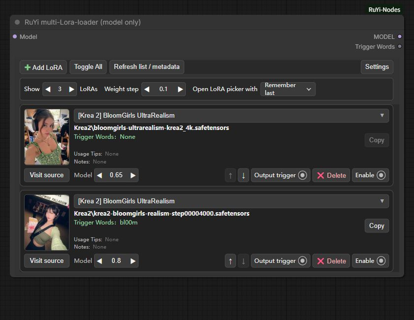</td>
<td valign="top">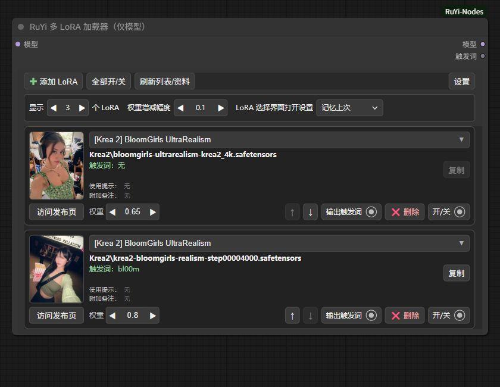</td>
</tr>
<tr><td colspan="2" align="center"><h3>RuYi Prompt / RuYi 提示词</h3>Sections, search, local completion and positive/negative conditioning · 分段、搜索、本地联想与正负条件输出</td></tr>
<tr>
<td valign="top">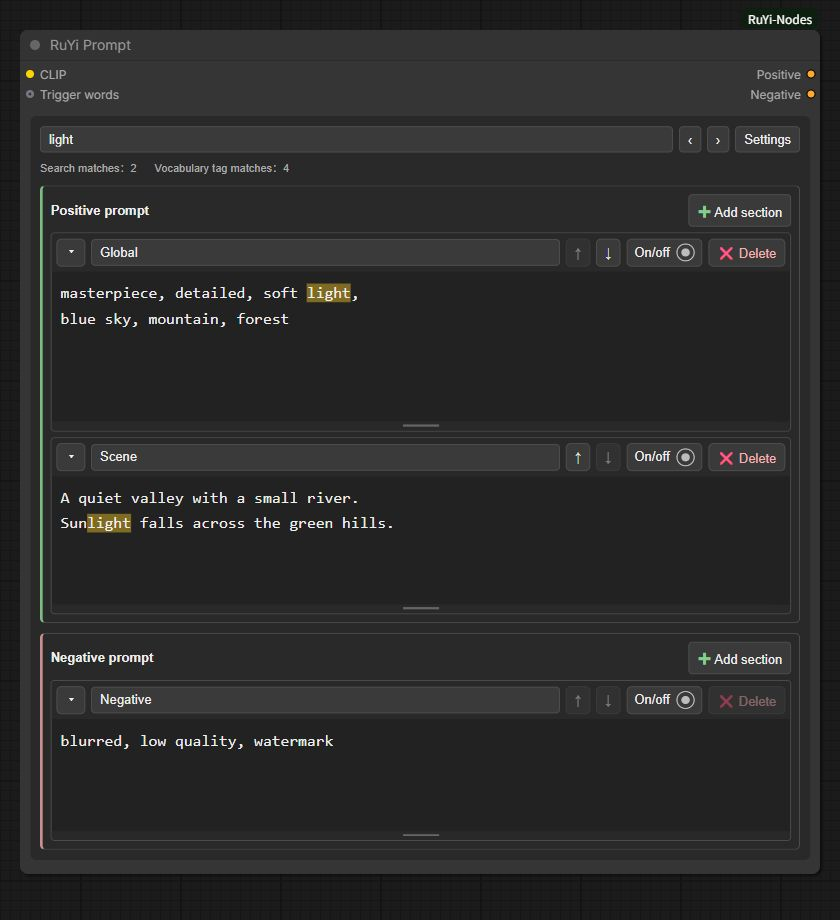</td>
<td valign="top">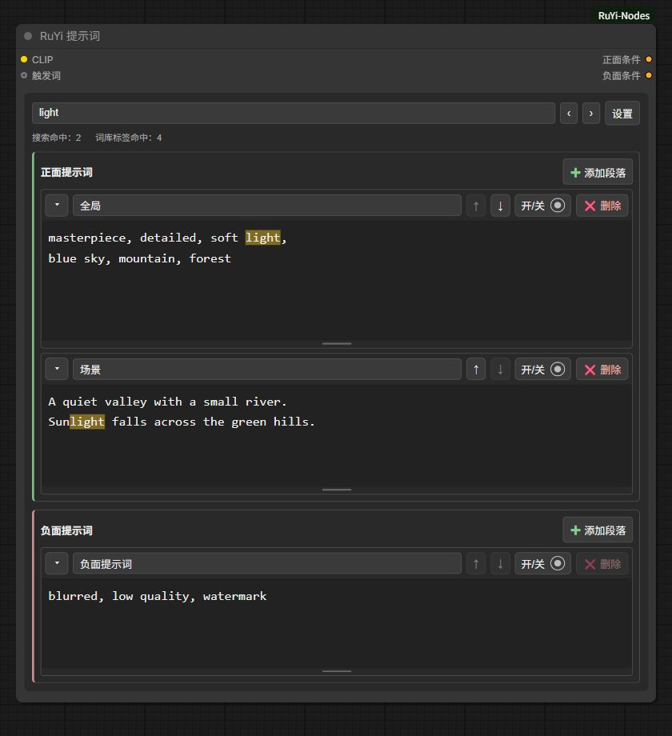</td>
</tr>
<tr><td colspan="2" align="center"><h3>RuYi Empty Latent Image / RuYi 空Latent图像</h3>Swap dimensions, presets, alignment and proportional scaling · 交换宽高、预设、对齐与等比缩放</td></tr>
<tr>
<td valign="top">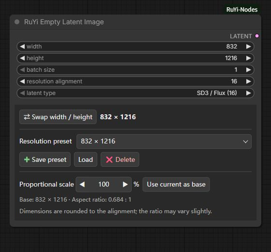</td>
<td valign="top">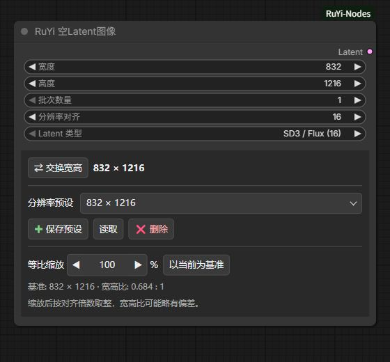</td>
</tr>
<tr><td colspan="2" align="center"><h3>Image Compare &amp; Save / 图像对比与保存</h3>Dynamic A/B comparison, enlarged view and independent save rules · 动态 A/B 对比、放大查看与独立保存规则</td></tr>
<tr>
<td valign="top">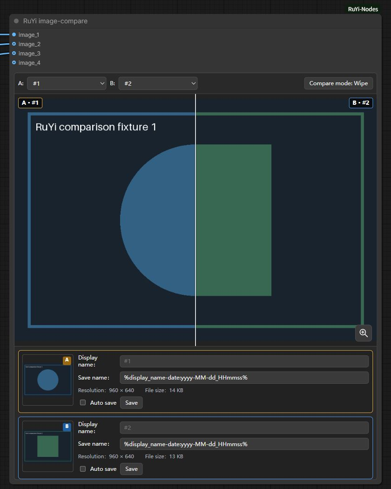</td>
<td valign="top">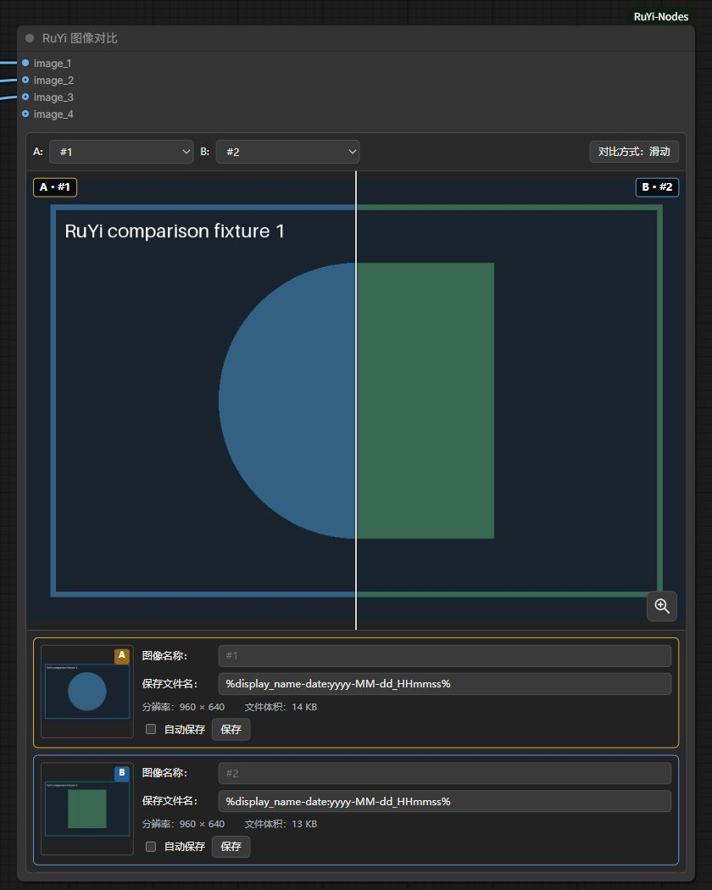</td>
</tr>
</table>

## English

### Included nodes

| Node | Input | Output | Purpose |
| --- | --- | --- | --- |
| **RuYi multi-Lora-loader** | `MODEL`, `CLIP` | `MODEL`, `CLIP`, `trigger_words` | Manage multiple LoRAs with independent MODEL and CLIP strengths. |
| **RuYi multi-Lora-loader (model only)** | `MODEL` | `MODEL`, `trigger_words` | Apply LoRAs to MODEL only. |
| **RuYi Prompt** | `CLIP`, optional trigger-word `STRING` | Positive and negative `CONDITIONING` | Edit sections and encode both prompts for a sampler. |
| **RuYi Empty Latent Image** | Width, height, batch, alignment, latent type | `LATENT` | Swap dimensions, manage presets and scale proportionally. |
| **RuYi image-compare** | Dynamic `IMAGE` inputs | — | Compare connected images and save them independently. |

### Visual Multi-LoRA Loader

- Add, remove, reorder and enable/disable LoRAs independently. Switching a LoRA or its trigger output preserves the list position.
- Use the full loader for separate MODEL/CLIP weights; use the model-only variant when your workflow applies LoRAs only to MODEL/UNET.
- Centered weight fields have left/right arrows. **Settings → Weight step** sets their adjustment amount, initially `0.1`.
- **Settings → Show N LoRAs** controls the viewport (`3` by default; `0` means unlimited).
- The searchable picker has separate folder and base-model filters. **Open LoRA picker with → Initial / Remember last** controls whether those filters reset or retain the last visit, including combinations with no matching entries.
- Enabled entries with **Output trigger** contribute to the deduplicated `trigger_words` STRING output. It can connect directly to RuYi Prompt's optional input; leaving it unconnected does not affect LoRA loading.
- Covers, friendly model names, trigger words, usage tips, notes, source links and recommended strengths are read from available metadata.

<table>
<tr><th width="50%">Full loader · English</th><th width="50%">完整加载器 · 中文</th></tr>
<tr><td>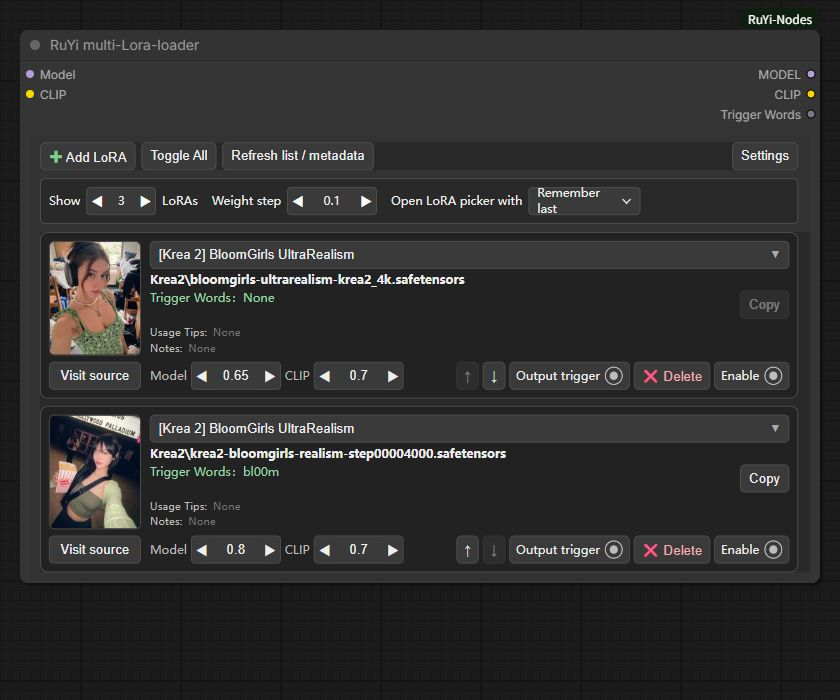</td><td>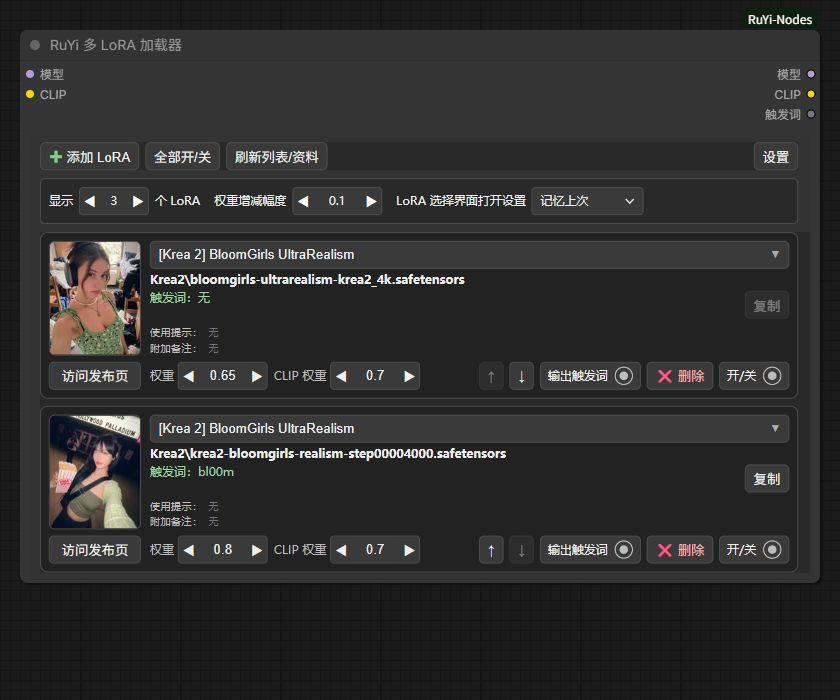</td></tr>
<tr><th>LoRA picker · English</th><th>LoRA 选择界面 · 中文</th></tr>
<tr><td>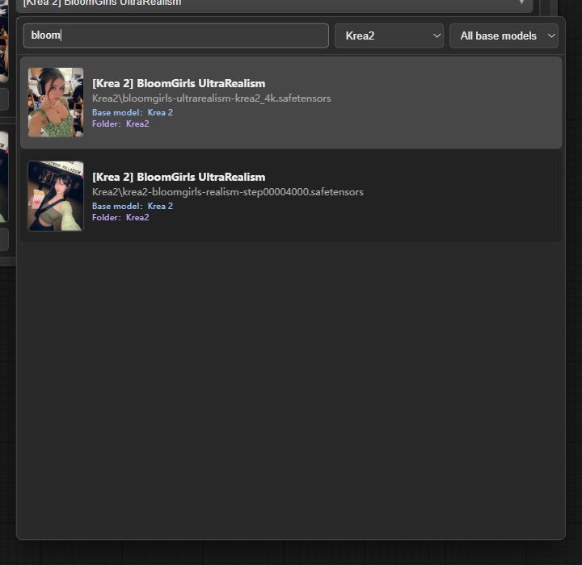</td><td>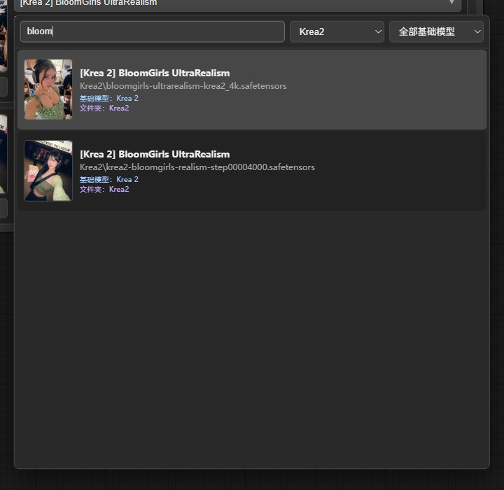</td></tr>
</table>

#### Metadata companion

Normal LoRA loading works independently. For rich previews and metadata, [ComfyUI-Lora-Manager](https://github.com/willmiao/ComfyUI-Lora-Manager) is recommended. RuYi reads its sidecars:

```text
my_lora.safetensors
my_lora.metadata.json
my_lora.jpeg
```

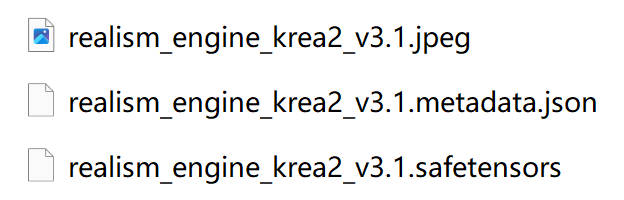

The prompt, latent and comparison nodes do not depend on LoRA Manager.

### RuYi Prompt

Connect the model's compatible CLIP encoder. The two outputs connect directly to a sampler's positive and negative inputs:

```text
CLIP ─────────────────────────> RuYi Prompt ── positive ──> Sampler
RuYi LoRA trigger_words STRING ─>             └─ negative ──> Sampler
```

- Positive and negative sides each support named sections, ordering, folding, enable switches and deletion. Drag a section's bottom bar to change its display height.
- Enabled sections are joined in order. LoRA trigger words are appended to the positive prompt during execution.
- Search highlights all matches; the arrows select and reveal the previous/next match. The main toolbar shows search hits and complete vocabulary-tag hits in enabled text.
- Settings can hide the negative panel without deleting its text. While hidden, the negative output encodes an empty prompt; a sampler may still require that connection.
- Local completion searches contiguous tag names/translations, ignoring case and treating spaces and underscores equivalently. Aliases require an exact match and are identified in the suggestion. Dispersed letters and single-letter queries do not produce loose matches.
- Completion rechecks after about 120ms of inactivity, focus or caret changes. Use Up/Down to select, Enter/Tab to insert, Escape to dismiss. It pauses during IME composition and preserves surrounding prose when inserting.
- Offline English spelling checks run after about 500ms of inactivity. Existing unchanged typo chips stay in place while typing. Click a chip under **Spelling errors:** to locate the word, replace it, ignore it or add it to the custom dictionary. Known tags and available LoRA trigger words are exempt; suggestions can still require manual judgment.
- Settings include prompt font size (`10–32px`, default `13px`), underscore mode, vocabulary sources, CSV import and custom words. Vocabulary readiness and record count are shown in settings.
- The bundled vocabulary has **508,152 entries**, merging local Danbooru exports, Chinese translations and a public snapshot. See [vocabulary provenance and rebuild instructions](data/prompt/README.md), [Typo.js license](js/prompt/vendor/TYPO-LICENSE.txt) and [dictionary licenses](js/prompt/vendor/EN-LICENSE.txt).
- Imported CSVs live in this browser's IndexedDB; custom words, section heights, font size and prompt settings travel with the workflow. Re-import CSVs when moving to another browser. Runtime features use local resources and do not automatically fetch updates.

Sections organize and concatenate text. They do **not** implement spatial regional conditioning. The node requires CLIP and outputs conditions rather than a plain STRING.

### RuYi Empty Latent Image

- **Swap width / height** switches orientation while retaining batch and latent type.
- **Resolution preset** stores only dimensions. **Save preset** always adds the current resolution or selects its existing identical entry; it never overwrites a different selected resolution. **Load** and **Delete** operate on the selected preset. Presets are shared in this browser's local storage.
- **Resolution alignment** selects multiples of `8`, `16`, `32` or `64`, initially `16`. Manual dimension changes, preset loading, scaling and execution round to the nearest chosen multiple.
- **Proportional scale** applies a percentage to a stable base. Arrows adjust it by 10 percentage points. Manual width/height edits and preset loading reset the base; **Use current as base** also resets it. Rounding can slightly change the aspect ratio. At the maximum size, both sides are limited together.
- **Latent type** controls the tensor layout: `SD3 / Flux (16)` uses 16 channels; `Anima (16)` adds a single-frame dimension; `SD1 / SDXL (4)` uses the native 4-channel image layout. The default is 16-channel SD3/Flux. Choose the layout expected by the model.
- Alignment and latent type are independent: alignment controls the image dimensions, while type controls channels/layout. All these layouts use an 8× spatial downscale; choosing alignment 16 does not make the latent 16 channels.
- Width/height range: `16–16384`; batch: `1–4096`. Connected width/height inputs disable local resolution actions; adjust them upstream.
- Scale base travels with the workflow. Controls fit their actual content height in either language, without a reserved blank status area.

### Image Compare & Save

1. Connect IMAGE outputs. An additional input appears as connections grow.
2. Select any two candidates with the **A** and **B** dropdowns.
3. **Wipe** follows horizontal pointer movement; **Click** switches between A and B.
4. Click the **magnifier with a plus** at the preview's bottom right to open the enlarged comparison. A/B selection, wipe/click mode and comparison interactions remain available. Escape, the close button or clicking the backdrop closes it; the chosen state remains in the node.
5. Each candidate supports its own display name, save-name/path template, auto-save toggle and manual save button. Resolution and PNG file size are displayed below its fields.

Without an explicit folder, saves go under `ComfyUI/output/RuYi-Compare/`. The default template is:

```text
%display_name-date:yyyy-MM-dd_HHmmss%
```

Available fields: `%display_name%`, `%save_name%`, `%index%`, `%input%`, `%frame%` and `%date:yyyy-MM-dd_HHmmss%`. RuYi's combined default template remains supported. Date patterns also work in folder components:

```text
%date:yyyy-MM-dd%/%display_name-date:yyyy-MM-dd_HHmmss%
D:\AI\Output\%date:yyyy-MM-dd%\%display_name-date:yyyy-MM-dd_HHmmss%
```

Date placeholders must include the surrounding percent signs (`%date:...%`); bare `date:...` is treated as literal text and its colon is sanitized. Relative folders stay under `RuYi-Compare`; absolute Windows paths save directly to that location. Existing names receive numeric suffixes rather than being overwritten.

Right-click a thumbnail for **Save as...** or **Copy image** using the full-resolution source. These are separate from **Save**, which follows the configured path. PNG saves retain prompt/workflow metadata when enabled and can restore a workflow when dragged into ComfyUI.

Comparison previews are registered in Media Assets/history. Their asset copies are separate from the node's A/B cache, so re-running a node replaces its comparison cache without invalidating earlier asset/history entries. ComfyUI manages those standard temporary assets. The redundant native in-node preview is suppressed.

### Installation and updates

```bash
cd ComfyUI/custom_nodes
git clone https://github.com/RuYi-Xiao/RuYi-Nodes.git
```

For an existing installation:

```bash
cd ComfyUI/custom_nodes/RuYi-Nodes
git pull
```

Or extract the GitHub ZIP into `custom_nodes/RuYi-Nodes`, with `__init__.py` directly inside that folder. Restart ComfyUI after installation or Python-node updates; use Ctrl+F5 for frontend cache refresh.

Search for the node names listed above. The former **RuYi text-preview** testing node has been removed; replace it in old workflows with a suitable STRING display utility.

## 简体中文

### 包含的节点

| 节点 | 输入 | 输出 | 用途 |
| --- | --- | --- | --- |
| **RuYi 多 LoRA 加载器** | `MODEL`、`CLIP` | `MODEL`、`CLIP`、`trigger_words` | 管理多个 LoRA，分别调整 MODEL 与 CLIP 权重。 |
| **RuYi 多 LoRA 加载器（仅模型）** | `MODEL` | `MODEL`、`trigger_words` | 只向模型加载 LoRA。 |
| **RuYi 提示词** | `CLIP`、可选触发词 `STRING` | 正面与负面 `CONDITIONING` | 分段编辑提示词并编码为采样条件。 |
| **RuYi 空Latent图像** | 宽高、批次、对齐、Latent 类型 | `LATENT` | 交换宽高、管理预设、等比缩放。 |
| **RuYi 图像对比** | 动态 `IMAGE` 输入 | — | 选择任意两张对比，并独立保存。 |

### 可视化多 LoRA 加载器

- 独立添加、删除、排序和开关 LoRA；切换开关或触发词输出时保持列表滚动位置。
- 完整版分别调整 MODEL / CLIP 权重；仅模型版用于只向 MODEL / UNET 应用 LoRA 的工作流。
- 权重数值居中，使用左右箭头调整。设置中的 **权重增减幅度** 默认为 `0.1`。
- **显示 N 个 LoRA** 已移入设置，默认 `3`，`0` 表示不限制列表显示数量。
- LoRA 选择界面分别筛选文件夹与基础模型。**初始 / 记忆上次** 决定重新打开时是否保留筛选组合，即使该组合没有匹配项也会保留。
- 已启用且勾选 **输出触发词** 的 LoRA 会合并去重后输出 STRING，可直接接入 RuYi 提示词。未连接此输出不影响加载。
- 支持读取封面、模型名、触发词、使用提示、备注、发布页链接和推荐权重。

普通 LoRA 加载可独立使用。丰富资料推荐配合 [ComfyUI-Lora-Manager](https://github.com/willmiao/ComfyUI-Lora-Manager)，读取同名 `.metadata.json` 与预览图片。完整加载器和选择界面的中英文对照图见上方英文部分。提示词、Latent 与图像对比节点不依赖 LoRA Manager。

### RuYi 提示词

连接模型对应的 CLIP 编码器，正负两个 CONDITIONING 输出可直接接入采样器。完整 LoRA 加载器可连接其 CLIP 输出；仅模型版使用原文本编码器。

- 正负提示词均支持段落命名、添加、折叠、排序、停用和删除；拖动段落底部横条调整显示高度。
- 按顺序拼接启用段落，执行时把已连接的 LoRA 触发词追加到正面提示词。
- 搜索高亮全部匹配；左右箭头定位上一处/下一处。常驻统计显示搜索命中与启用文本中完整词库标签的命中次数。
- 设置可关闭负面板块，保留已写内容；关闭时负面输出编码空提示词，采样器仍可能要求连接负面条件。
- 本地联想要求名称或译名连续匹配完整输入，忽略大小写并统一空格与下划线；别名只接受完整精确匹配并注明命中别名，不把分散字母或单字母当作宽泛匹配。
- 停止输入约 120ms 后查询，移动光标、重新聚焦也可触发。上下箭头选候选，Enter/Tab 插入，Escape 关闭；中文输入法组词期间暂停，插入时保留句子其余内容。
- 停止输入约 500ms 后检查英语拼写，未变化的错词标签不反复清空重建。点击 **拼写错误：** 下的标签，菜单可定位单词、替换、忽略或加入自定义词典。已知 tags 与可用触发词作为例外；建议仍需按语境判断。
- 设置可调整文字大小（默认 `13px`，`10–32px`）、下划线模式、词库来源，导入 CSV 并编辑自定义词。词库就绪状态和总量移入设置。
- 内置 **508,152 条**本地词库，合并导出的 Danbooru tags、中文译名及公开快照。来源、构建方式和第三方许可见 [词库说明](data/prompt/README.md)。运行时仅访问本机资源，不自动联网更新。
- 导入词表保存在当前浏览器 IndexedDB；自定义词、段落高度、字号和设置随工作流保存。更换浏览器后需重新导入词表。

分段用于组织和拼接文本，**不等同于空间区域条件或区域采样**。此节点需要 CLIP，输出采样条件而非普通 STRING。

### RuYi 空Latent图像

- **交换宽高**一键切换横竖构图，保留批次和类型。
- **分辨率预设**只保存宽高。保存时新增分辨率，完全相同的宽高自动去重；不会覆盖当前选中的其他预设。支持读取、删除，预设保存在当前浏览器本地存储并供不同工作流共用。
- **分辨率对齐**选择 `8 / 16 / 32 / 64` 的倍数，默认 `16`。手动调整、读取预设、缩放和执行时均按最近倍数取整。
- **等比缩放**按稳定基准和百分比计算，箭头每次调整 10 个百分点。手动改宽高或读取预设会更新基准，也可点击“以当前为基准”。对齐会造成轻微比例偏差，到达上限时两边一起限制。
- **Latent 类型**决定通道和张量布局：默认 `SD3 / Flux (16)`；`Anima (16)` 增加单帧维度；`SD1 / SDXL (4)` 与原生空 Latent 图像的 4 通道布局一致。按模型要求选择。
- 对齐和类型相互独立：前者约束图像宽高，后者决定通道/布局。它们都按 8 倍空间下采样；对齐选择 16 并不意味着 16 通道。
- 宽高范围 `16–16384`、批次 `1–4096`。宽高接入连线时禁用本地分辨率操作，请在上游调整。
- 缩放基准随工作流保存。中英文控件区均按实际内容收紧，不预留空白状态区域。

### 图像对比与保存

- 连接 IMAGE 输入后自动补充下一输入，使用 A/B 选单切换任意两张。
- **滑动**模式随指针水平移动对比线；**点击**模式切换 A/B。
- 点击展示区右下角 **加号放大镜**，在放大界面继续选择 A/B、切换模式和对比；Escape、关闭按钮或点击遮罩退出，状态保留。
- 每张图片可独立设置图像名称、保存文件名/路径、自动保存和手动保存，显示分辨率与 PNG 文件体积。
- 没有明确文件夹时保存到 `ComfyUI/output/RuYi-Compare/`，默认命名为 `%display_name-date:yyyy-MM-dd_HHmmss%`。
- 支持 `%display_name%`、`%save_name%`、`%index%`、`%input%`、`%frame%`、`%date:yyyy-MM-dd_HHmmss%`。组合模板保持兼容，日期也可用于文件夹：

```text
%date:yyyy-MM-dd%/%display_name-date:yyyy-MM-dd_HHmmss%
D:\AI\Output\%date:yyyy-MM-dd%\%display_name-date:yyyy-MM-dd_HHmmss%
```

日期占位符需要包含两侧百分号，如 `%date:yyyy-MM-dd%`；不带百分号的 `date:...` 会被当作普通文字，冒号会被替换。相对路径保存在 RuYi-Compare 内，绝对 Windows 路径直接保存到指定位置；同名文件自动增加编号，不覆盖已有图片。

右键缩略图可 **另存为 / 复制图片**，使用原始分辨率；与遵循节点保存规则的“保存”按钮相互独立。启用元数据时 PNG 保留提示词和工作流，可拖回 ComfyUI 恢复。

结果显示在媒体资产/历史中，其副本与节点 A/B 预览缓存分离；重新执行替换节点缓存时，不使旧媒体资产失效。标准临时资产仍由 ComfyUI 管理。节点内冗余的原生预览已隐藏。

### 安装和更新

在 `ComfyUI/custom_nodes` 中执行：

```bash
git clone https://github.com/RuYi-Xiao/RuYi-Nodes.git
```

更新已有安装：

```bash
cd ComfyUI/custom_nodes/RuYi-Nodes
git pull
```

也可下载 GitHub ZIP，确保 `custom_nodes/RuYi-Nodes/__init__.py` 直接存在，避免多套一层同名目录。安装或 Python 节点更新后重启 ComfyUI；前端缓存可用 Ctrl+F5 刷新。

旧的 **RuYi 文本监视** 测试节点已移除；旧工作流可改用其他 STRING 显示工具。

## Shared appearance / 统一配色

All four interfaces and their menus use shared grayscale tokens: node `#333333`, groups `#292929`, content `#222222`, controls `#3A3A3A`, border `#505050`, hover `#474747`. Functional green/red, positive/negative and A/B accents remain distinct. Native ComfyUI node chrome retains its own appearance settings.<br>
四类界面与选单共用灰阶：节点底色 `#333333`、分组 `#292929`、内容区 `#222222`、控件 `#3A3A3A`、边框 `#505050`、悬停 `#474747`。保留添加/删除、正负提示词及 A/B 的功能色；原生节点外壳仍遵循 ComfyUI 外观设置。

## Changelog and license / 更新记录与许可

See [CHANGELOG.md](CHANGELOG.md) for changes. Released under the [MIT License](LICENSE); third-party vocabulary/spelling resources retain their own attribution and licenses.<br>
更新内容见 [CHANGELOG.md](CHANGELOG.md)。项目使用 [MIT License](LICENSE)，第三方词库与拼写资源保留各自来源及许可。
